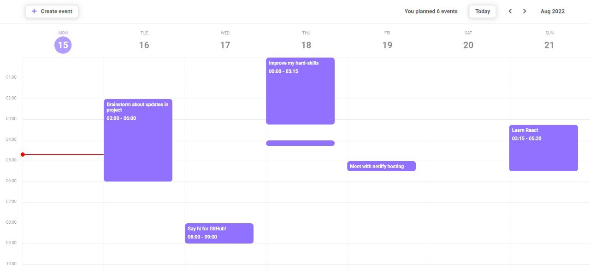

# 📅Calendar project

  

### _React-powered application for time-management and planning events_

## ✨Features

- Possibility to show and update current event information
- User-friendly and minimalistic design
- Events overlap dynamic validation
- Events create form autofilling
- Timeline shows current time
- Added tasks dynamic counter

## ⚙️Used technologies:

- HTML5
- CSS3
- Flexbox
- SASS preprocessor
- BEM methodology
- JS ES6
- React 
- Webpack
- Babel
- ESLint


## Installation

Move to the fold, install all dependencies and run the server:

```sh
cd calendar-react
npm i
npm start
```
#### In order to build production version:

```sh
npm run build
```

Calendar requires [NodeJS](https://nodejs.org/) v10+ to build

<hr/>

### Application available via [link](https://master--rococo-smakager-b948fc.netlify.app/) 👈🏻 ###

### Developed by [Andrii Shevchuk](https://github.com/Andrii618/) ###
